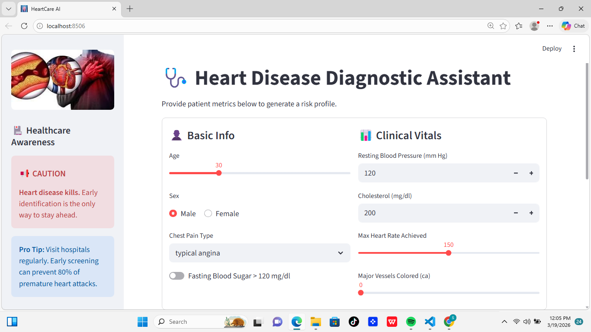
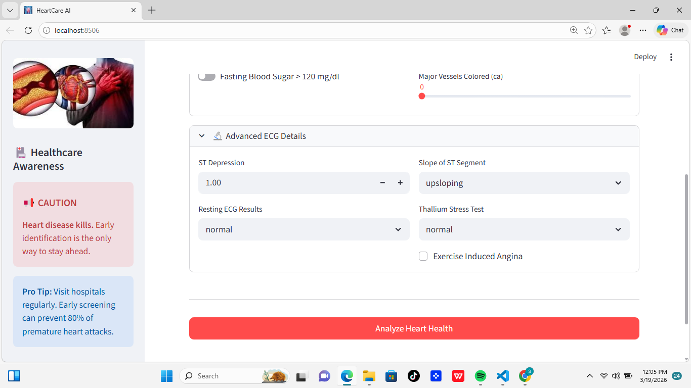

# HeartCare AI: Diagnostic Assistant

An end-to-end Machine Learning web application designed to help healthcare providers assess heart disease risk based on patient clinical vitals.

##  How to Run Locally

Follow these steps to set up the project on your machine:

1. **Clone the repository:**
   ```bash
   git clone <your-repository-link>
   cd Heart_Disease_Project
   ```
   

2. **Install dependencies**
   ```bash
   pip install -r requirements.txt
   ```

3. **Launch the Dashboard**
   ```bash
   streamlit run app/streamlit_app.py
   ```
   


##  Features
* **Real-time Prediction:** Uses Logistic Regression to provide risk scores.
* **Medical Dashboard:** Interactive UI built with Streamlit.
* **Explainable AI:** Displays confidence levels for every diagnosis.

##  Tech Stack
* **Python** (Logic & Data Processing)
* **Scikit-Learn** (Machine Learning)
* **Streamlit** (Web Interface)
* **Pandas/Numpy** (Data Manipulation)

## 📸 Preview

